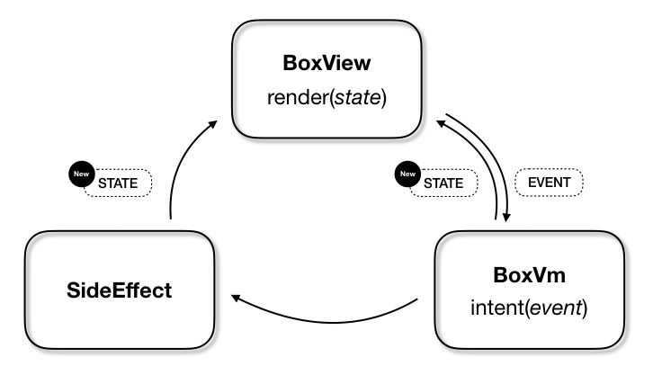
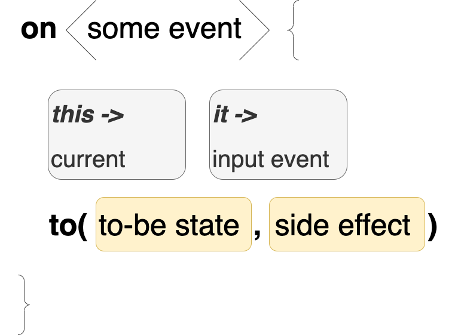
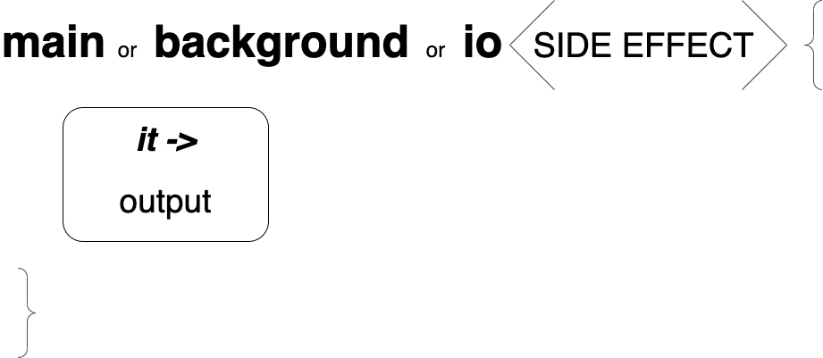

# Box in Android

Myrealtrip 모바일 팀은 보다 빠르고 안정적으로 Android 앱을 개발 할 수 있도록 우리 앱 아키텍쳐를 향상시키는 방법을 항상 고민하고 있습니다. 

Box는 StateMachine 에서 영감 받은 [Blueprint](#what-is-blueprint) 와 Kotlin의 코루틴을 활용한 MVI 기반의 Android 앱 아키텍처 프레임 워크입니다. 이 페이지에서는 Box의 기본 컨셉과 Box를 사용하여 어떻게 테스트 가능한 구조의 앱을 개발할 수 있을지에 대해 소개 합니다.


## MVI

Box는 MVI 아키텍처를 기반으로 하고 있습니다. MVI 아키텍처에 대한 자세한 내용은 다음 [링크](https://link.medium.com/0cBFY3nEC4)를 확인해주세요. MVI 아키텍처에서 소개하는 데이터 흐름과 동일하게 Box의 데이터 흐름은 단방향입니다. 아래 표를 참고해주세요.




## Goals

Box는 다음과 같은 목표를 해결하기 위해 디자인되었습니다.

1. 앱의 현재 상태를 표현하는 **하나의 불변 상태**와 **단방향 데이터 흐름**으로 제어와 디버깅이 용이한 Android 앱 개발 방법 제안
2. Blueprint를 기반으로 패턴화된 테스트 코드 작성법 제안

## Basic Concept of Component

Box는 전통적인 MVI 아키텍처와 같이 State, Event, SideEffect 로 동작합니다. 각각 컴포넌트들은 어떤 역할을 하는지 알아봅시다.

### State

State는 앱의 단 하나의 불변 상태를 나타냅니다. 쉽게 말하면, 앱이 화면을 그리는데 필요한 정보를 담고 있습니다. View는 State에 있는 정보를 바탕으로 화면을 그립니다.

### Event

State 즉, 앱 상태의 변화를 위한 트리거입니다. 사용자의 인터렉션이 될 수도 있고 후술할 SideEffect의 결과로 발생할 수도 있습니다. 또는 화면의 초기화를 위해 코드에서 임의로 발생시킬 수도 있습니다.

### SideEffect

State 변경으로 처리 할 수 없는 작업들, 예를 들어 토스트 메시지, 다이얼로그 노출, 액티비티 이동 같은 작업을 처리하는데 사용합니다. 그 밖에 Background 작업이 필요한 경우 즉, 서버 API 통신, I/O 작업에도 SideEffect를 사용하여 처리 할 수 있습니다.

### What is Blueprint?

앞서 소개한 State, Event, SideEffect 사이의 관계를 정의 할때 일반적으로 `Presenter` 나  `ViewModel`의 `reduce()` 함수를 구현합니다. `reduce()` 함수는 현재 State와 새로 발생한 Event를 인자로 받고 새로운 State를 반환하며 필요할때 SideEffect를 발생시키도록 구현됩니다. Box는 이러한 reduce() 함수의 구현 대신 Blueprint 라고 이름 지어진 DSL을 사용하여 State, Event, SideEffect의 관계를 정의합니다.

Blueprint는 크게 Event 정의와 SideEffect 정의로 나눠집니다. 자세한 사용법은 샘플 코드를 참고해주세요.


## How do I use Box?

### Dependency

최상위 프로젝트 build.gradle 파일에 아래의 코드를 추가해주세요.

```gradle
allprojects {
    repositories {
    	// ... Your repositories.
        maven { url "https://jitpack.io" } 
    }
}
```

모듈 build.gradle 에는 아래 코드를 추가해주세요.

```gradle
dependencies {
	// ... Your dependencies.
	implementation "com.github.myrealtrip:box:$boxVersion"
	implementation "org.jetbrains.kotlinx:kotlinx-coroutines-core:$kotlinCoroutinesVersion"
	implementation "org.jetbrains.kotlinx:kotlinx-coroutines-android:$kotlinCoroutinesVersion"
}
```

### Quick Start

#### 1. State, Event, SideEffect 정의

Box로 개발하는 앱은 각 화면마다 사용하는 고유한 State, Event, SideEffect 가 있습니다. 해당 화면에 필요한 각각의 컴포넌트들을 정의해주세요.

   ```kotlin
   data class ExampleState(
       val onProgress: Boolean = false,
       val onError: Throwable? = false,
       val data: Data? = null
   ) : BoxState
   ```
   
   ```kotlin
   sealed class ExampleEvent : BoxEvent {
       object ReqeustData: ExampleEvent()
       data class FetchedData(val data: Data): ExampleEvent()
       data class OnError(val throwable: Throwable): ExampleEvent()
       object OnDataClicked: ExampleEvent()
   }
   ```
   
   ```kotlin
   sealed class ExampleSideEffect : BoxSideEffect {
       object RequestData: ExampleSideEffect()
       object OnDataClicked: ExampleSideEffect()
   }
   ```
   
   
#### 2. Vm 정의
   
Box는 `AndroidViewModel`을 구현한 `BoxVm` 을 제공합니다. BoxVm은 위에 정의한 State, Event, SideEffect 들의 상호 관계를 정의한 Blueprint와 각각의 SideEffect들을 수행하는 코드를 포함합니다.

```kotlin
class ExampleVm : BoxVm<ExampleState, ExampleEvent, ExampleSideEffect>() {

   override val blueprint: BoxBlueprint<ExampleState, ExampleEvent, ExampleSideEffect>
       get() = onCreatedBlueprint()

   fun requestDataAsync() = async {
       return@async Api.requestData().onSuccessed {
           ExampleEvent.FetchedData(it.data)
       }.onFailed {
           ExmpleEvent.OnError(it.error)
       }
   }

   fun moveToNextScreen() {
       startActivity<NextActivity>()
   }
}
```

앗, 그런데 위 예제 코드에서는 blueprint의 모양이 전혀 나와 있지 않네요. Box는 `BoxVm`의 원할한 테스트를 위해 Blueprint 생성 코드를 해당 Vm의 확장 함수 형태로 정의하는 방법을 권장합니다. 아래 코드를 참고해 주세요.

```kotlin
fun ExampleVm.onCreatedBlueprint() 
            : BoxBlueprint<ExampleState, ExampleEvent, ExampleSideEffect> {
       return bluePrint(ExampleState()) {
           on<ExampleEvent.ReqeustData> {
               to(copy(onProgress = true), ExampleSideEffect.RequestData)
           }
           background<ExampleSideEffect.RequestData> {
               requestDataAsync()
           }
   
           on<ExampleEvent.FetchedData> {
               to(copy(onProgress = false, data = it.data))
           }
           on<ExampleEvent.OnError> {
               to(copy(onProgress = false, onError = it.error))
           }
   
           on<ExampleEvent.OnDataClicked> {
               to(ExampleSideEffect.OnDataClicked)
           }
           main<ExampleSideEffect.OnDataClicked> {
               moveToNextScreen()
           }
       }
   }
```

위 Blueprint의 내용을 간단하게 설명하자면 아래와 같습니다.

- `ExampleEvent.ReqeustData` Event가 발생했을땐 현재 State에서 `onProgress` 값만 `true` 로 변경하고 `ExampleSideEffect.RequestData` 를 발생시킵니다. `ExampleSideEffect.RequestData`가 발생하면 `requestDataAsync()` 함수를 `Diapathcer.Default` 에서 호출합니다.

한가지 케이스를 더 살펴 볼까요?

- `ExampleEvent.OnDataClicked` Event가 발생하면 현재 State를 변경하지 않고 `ExampleSideEffect.OnDataClicked` 만 발생시킵니다. `ExampleSideEffect.OnDataClicked`가 발생하면 `Dispathcer.Main` 에서 `moveToNextScreen()` 함수를 호출합니다.

참 쉽죠? bluePrint를 구성하는 두 개의 큰 축은 Event 선언과 SideEffect 선언입니다. 각각 `on()`, `main()`, `background()`, `io()` 함수를 사용하는데 그 모양은 아래 이미지를 참고해주세요.

<br/><br/>

- `on()` 함수는 정의할 Event를 제네릭 형태로 선언합니다.
- `on()` 함수의 코드 블록은 현재 State를 `this` 로, 전달 될 Event를 `it` 으로 받습니다.
- `on()` 함수는 `to()` 함수 구현으로 이 Event가 어떤 State로 변할지 또는 어떤 SideEffect가 발생해야 하는지 정의합니다.
- `to()` 함수는 새로 생성될 Event만 갖을 수도 있고 발생할 SideEffect만 갖을 수도 있습니다. 때론은 두 개의 값을 다 정의할 수도 있고 두 개의 값을 모두 갖지 않을 수도 있습니다. 당연하게도 두개의 값을 모두 갖지 않을때는 아무런 동작을 하지 않습니다.

<br/><br/>

- SideEffect는 3가지 유형의 함수로 선언할 수 있습니다. SideEffect도 Event 선언과 마찬가지로 각각 SideEffect를 제네릭으로 선언합니다. 
-  `main()` 함수는 `Dispathcer.Main` 에서 동작합니다. 다이얼로그나 팝업을 노출하거나 화면을 전환하는 이벤트를 처리하기에 적합합니다.
-  `background()` 함수는 일반적인 background 작업을 처리하는데 적합합니다. 
-  `io()` I/O 작업과 같이 background 작업을 수행하지만 우선순위가 낮은 작업을 처리하기 적합합니다.
-  코드 블록으로 전달되는 `Output.Valid` 객체로 전달된 SideEffect, 이전/이후 State를 참조할 수 있습니다.


#### 3. View의 정의 

View는 `BoxActivity` 또는 `BoxFragment` 를 구현합니다. 이 예제에서는 `BoxActivity` 를 사용합니다. 아래 코드를 봐주세요.

```kotlin
   class ExampleActivity
       : BoxActivity<ExampleState, ExampleEvent, ExampleSideEffect>() {
   
       override val renderer: BoxRenderer<ExampleState, ExampleEvent>?
               = ExampleRenderer
       override val viewInitializer: BoxViewInitializer<ExampleState, ExampleEvent>?
               = ExampleInitView
       override val layout: Int
               = R.layout.activity_example
   
       override val vm: ExampleVm by lazy {
           ViewModelProviders.of(this).get(ExampleVm::class.java)
       }
   }
```

> **What is BoxViewInitializer?**
> 
> View가 초기화 되면서 1회 호출됩니다. RecyclerView 나 ViewPager에 Adapter를 설정하는 등 View 초기화와 화면에 진입했을때 발생시켜야하는 Event가 있을때 처리하는 용도로 사용할 수 있습니다.


>**What is BoxRenderer?**
> 
> 그려야할 새로운 State가 발생 했을때 View의 render() 함수가 호출됩니다. 간단한 화면이라면 BoxActivity의 render 함수를 오버라이드 하면 되지만 코드의 가독성과 관리를 위해 BoxRenderer 를 확장하여 사용하길 권장합니다.


## Debugging

> intent() 와 render()만 기억해주세요!

Box는 불변하는 상태값이 단방향으로 흐르도록 설계되었습니다. 모든 이벤트는 `BoxVm`의 `intent()` 함수를 통해 전달되고 `intent()` 함수를 통해 생성된 새로운 상태는 View의 `render()` 함수에 전달되어 그려집니다. 앱을 개발하다 흔히 발생할 수 있는 에러 상황에서 확인해야할 포인트가 정해져 있기 때문에 복잡한 화면을 그릴때에도 비교적 디버깅이 용이합니다. 


## Testing

Box는 `BoxVm`에 정의된 Blueprint를 기반으로 동작합니다. Blueprint가 의도한대로 동작한다면 앱이 제대로 동작한다고 간주할 수 있습니다. Blueprint는 미리 정의된 DSL 내에서 구현하므로 가이드에 맞게 개발했다면 아래의 테스트 방법을 적용할 수 있습니다. `BoxVm`의 테스트 코드를 작성할때 아래의 테스트 클래스를 확장하는 것을 추천합니다. 

> 이 테스트 코드는 Mockito를 사용하여 작성되었습니다.

```kotlin
abstract class VmTest<S : BoxState, E : BoxEvent, SE : BoxSideEffect> {

    @get:Rule
    val instantExecutorRule = InstantTaskExecutorRule()
    private val mainThreadSurrogate = newSingleThreadContext("UI thread")
    abstract val vm: BoxVm<S, E, SE>
    abstract fun emptyState(): S

    @Before
    fun setUp() {
        Dispatchers.setMain(mainThreadSurrogate)
    }

    @After
    fun tearDown() {
        Dispatchers.resetMain()
        mainThreadSurrogate.close()
    }

    protected fun BoxVm<S, E, SE>.testIntent(
        event: E,
        state: S = emptyState()
    ): BoxOutput<S, E, SE> {
        val output = mockBlueprint().reduce(state, event)
        Mockito.`when`(intent(event)).thenReturn(output)
        return intent(event) as BoxOutput.Valid<S, E, SE>
    }

    protected fun <S : BoxState, E : BoxEvent, SE : BoxSideEffect> BoxOutput<S, E, SE>.valid(): BoxOutput.Valid<S, E, SE> {
        return this as BoxOutput.Valid<S, E, SE>
    }
    
    protected fun doIoSideEffect(output: BoxOutput.Valid<S, E, SE>) {
        mockBlueprint().ioWorkOrNull(output.sideEffect)!!(output.valid())
    }

    protected fun doHeavySideEffect(output: BoxOutput.Valid<S, E, SE>) {
        mockBlueprint().heavyWorkOrNull(output.sideEffect)!!(output.valid())
    }

    protected fun doSideEffect(output: BoxOutput.Valid<S, E, SE>) {
        mockBlueprint().workOrNull(output.sideEffect)!!(output.valid())
    }

    abstract fun mockBlueprint(): BoxBlueprint<S, E, SE>
}
```

이 기본 테스트 클래스는 `BoxVm`에 특정 Event가 `intent()` 되었을때 생성되는 새로운 State와 SideEffect를 mocking 하고 검증 할 수 있도록 도와줍니다. 이 클래스를 확장하여 작성한 테스트 코드는 아래와 같습니다.

```kotlin
class ExampleVmTest : VmTest<ExampleState, ExampleEvent, ExampleSideEffect>() {

    override val vm: ExampleVm = mock(ExampleVm::class.java)

    override fun emptyState(): ExampleState {
        return ExampleState()
    }

    @Test
    fun `intent RequestData`() {
        val output = vm.testIntent(ExampleEvent.RequestData)
        assertTrue(output.valid().to.onProgress)
        doHeavySideEffect(output.valid())
        verify(vm).requestDataAsync()
    }

    @Test
    fun `intent FetchedData`() {
        val data = mock(Data::class.java)
        val output = vm.testIntent(ExampleEvent.FetchedData(data))
        assertEquals(output.valid().to.data, data)
    }

    @Test
    fun `intent OnError`() {
        val throwable = mock(Throwable::class.java)
        val output = vm.testIntent(ExampleEvent.OnError(throwable))
        assertEquals(output.valid().to.onError, data)
    }

    @Test
    fun `intent OnDataClicked`() {
        val output = vm.testIntent(ExampleEvent.OnDataClicked)
        doSideEffect(output.valid())
        verify(vm).moveToNextScreen()
    }

    override fun mockBlueprint(): BoxBlueprint<ExampleState, ExampleEvent, ExampleSideEffect> {
        return vm.onCreatedBlueprint()
    }
}
```


## Compatibility

- Box는 `Api level 16` 이상을 지원합니다.
- Box는 Kotlin `1.3.41` 버전으로 개발되었습니다.
- Box는 Kotlin Coroutine `1.3.3` 버전으로 개발되었습니다.


## Licence

```
The MIT License (MIT)

Copyright (c) 2020 Myrealtrip

Permission is hereby granted, free of charge, to any person obtaining a copy
of this software and associated documentation files (the "Software"), to deal
in the Software without restriction, including without limitation the rights
to use, copy, modify, merge, publish, distribute, sublicense, and/or sell
copies of the Software, and to permit persons to whom the Software is
furnished to do so, subject to the following conditions:

The above copyright notice and this permission notice shall be included in all
copies or substantial portions of the Software.

THE SOFTWARE IS PROVIDED "AS IS", WITHOUT WARRANTY OF ANY KIND, EXPRESS OR
IMPLIED, INCLUDING BUT NOT LIMITED TO THE WARRANTIES OF MERCHANTABILITY,
FITNESS FOR A PARTICULAR PURPOSE AND NONINFRINGEMENT. IN NO EVENT SHALL THE
AUTHORS OR COPYRIGHT HOLDERS BE LIABLE FOR ANY CLAIM, DAMAGES OR OTHER
LIABILITY, WHETHER IN AN ACTION OF CONTRACT, TORT OR OTHERWISE, ARISING FROM,
OUT OF OR IN CONNECTION WITH THE SOFTWARE OR THE USE OR OTHER DEALINGS IN THE
SOFTWARE.
```

